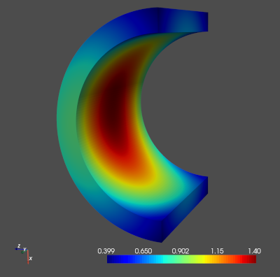
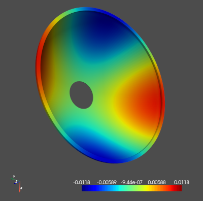

# tensiga

Implementation of a matrix-free isogeometric Galerkin method for Karhunen-Loeve approximation of random fields using tensor product splines, tensor contraction and interpolation based quadrature.

Preprint: https://arxiv.org/abs/2011.13861  
Publication: https://doi.org/10.1016/j.cma.2021.113730

## Installation

Until the package is officially registered in the public Python Package Index, I recommend the following procedure

1. Clone the repository to your local machine and navigate to the main directory
2. Run ``sudo pip3 install -e ./`` in order to install the ``tensiga`` package locally on your machine.

The installation references to the cloned repository. You can work on this repository and changes will be immediately applied to the installation.

As soon as the package becomes available in the Python Package Index, it can be installed by running

    sudo pip3 install tensiga

### Notice

``Scikit-sparse`` requires ``libsuitesparse`` to build. Ubuntu users can install this library as follows

    # apt update && apt install libsuitesparse-dev

Archlinux users might need to provide the ``suitesparse`` package

    # pacman -Suy suitesparse

## Examples

Many modules and routines have sample code in the ``__main__`` function, which can be run from the terminal, i.e.

    $ python3 -i tensiga/iga/bfun.py

Besides that, under ``bin/`` you can find some full examples to run, i.e.

    $ python3 -i bin/ibq_mf_galerkin3d.py

which produces

or a more computationally involved example, like

    $ python3 -i bin/spherical_shell.py

which produces

The sample scripts are also available system-wide and directly from the terminal, i.e.

    $ ibq_mf_galerkin3d.py
